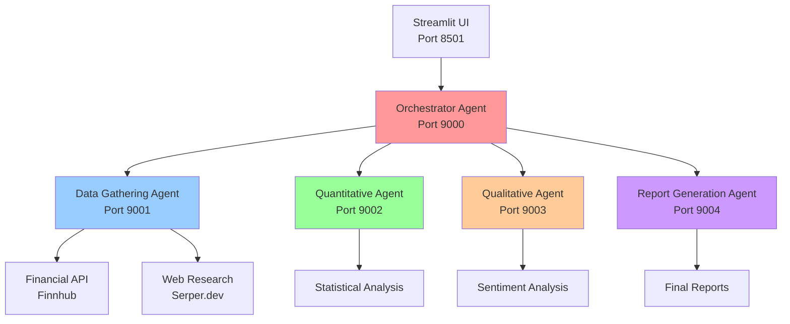

# Financial Multi-Agent System (MAS) 🤖💰

[](https://www.python.org/downloads/)
[](LICENSE)
[](#architecture)
[](#features)
[](#quick-start)

> A sophisticated financial research system built with multi-agent architecture, featuring distributed agents that collaborate through A2A (Agent-to-Agent) protocol to provide comprehensive stock analysis and investment recommendations.

## 🌟 Features

- 🤖 **5 Specialized AI Agents** working in coordination
- 📊 **Real-time Financial Data** from Finnhub API
- 🔍 **Web Research Integration** via Serper.dev
- 📈 **Quantitative & Qualitative Analysis**
- 📋 **Automated Report Generation**
- 🌐 **Streamlit Web Interface**
- 🔄 **A2A Communication Protocol**
- 🛠️ **MCP Tool Integration**
- ✅ **Comprehensive Testing Suite**

## 🏗️ Architecture



### Agent Responsibilities

| Agent | Port | Function |
|-------|------|----------|
| 🎯 **Orchestrator** | 9000 | Workflow coordination and task distribution |
| 📊 **Data Gathering** | 9001 | Financial data retrieval and web research |
| 📈 **Quantitative** | 9002 | Statistical analysis and metrics calculation |
| 🧠 **Qualitative** | 9003 | Sentiment analysis and market perception |
| 📋 **Report Generation** | 9004 | Final report synthesis and recommendations |

## 🚀 Quick Start

### Prerequisites

- Python 3.8+
- API Keys (Free tiers available):
  - [Finnhub](https://finnhub.io/) - Financial data
  - [Serper.dev](https://serper.dev/) - Web search
  - [OpenAI](https://platform.openai.com/) - AI features

### Installation

```bash
# Clone the repository
git clone https://github.com/Ak-9647/financial_MAS_Project.git
cd financial_MAS_Project

# Create virtual environment
python3 -m venv venv
source venv/bin/activate  # On Windows: venv\Scripts\activate

# Install dependencies
pip install -r requirements.txt

# Setup environment variables
python3 setup_env.py
# Edit .env file with your API keys
```

### Running the System

```bash
# Start all agents
python3 start_system.py

# In another terminal, start the UI
streamlit run app.py

# Or run quick test
python3 quick_test.py
```

## 📊 Usage Examples

### Stock Analysis
```bash
curl -X POST http://localhost:9000/ \
  -H "Content-Type: application/json" \
  -d '{"message": {"role": "user", "parts": [{"text": "{\"query\": \"Analyze Apple (AAPL) stock performance\"}"}]}}'
```

### Investment Research
- "Analyze Tesla's latest earnings and market sentiment"
- "Compare NVIDIA vs AMD financial metrics"
- "Provide investment recommendation for Microsoft"

## 🧪 Testing

```bash
# Quick system test
python3 quick_test.py

# Comprehensive test suite
python3 test_system.py

# API key validation
python3 check_api_keys.py
```

## 📁 Project Structure

```
financial_MAS_Project/
├── 🤖 agents/                    # Agent implementations
├── 🔧 services/                  # Business logic services  
├── 🌐 mcp_servers/              # MCP tool servers
├── 🛠️ utils/                    # Utility modules
├── 🗄️ db/                       # Database files
├── 🚀 start_system.py           # System startup
├── 🖥️ app.py                    # Streamlit UI
├── 📋 requirements.txt          # Dependencies
└── 📖 README.md                 # Documentation
```

## 🔧 Configuration

### Environment Variables
```bash
# Required API Keys
FINNHUB_API_KEY=your_finnhub_key
SERPER_DEV_API_KEY=your_serper_key
OPENAI_API_KEY=your_openai_key

# Optional Settings
CHROMA_DB_PATH=./db/chroma_db
LOG_LEVEL=INFO
```

### Port Configuration
- **UI**: 8501 (Streamlit)
- **Agents**: 9000-9004
- **MCP Servers**: 8001-8003

## 📈 Performance

- ⚡ **Response Time**: < 30 seconds for complete analysis
- 🔄 **Concurrent Requests**: Supports multiple simultaneous analyses
- 📊 **Data Sources**: Real-time market data + web research
- 🎯 **Accuracy**: Multi-agent validation and cross-checking

## 🛠️ Development

### Adding New Agents
1. Create agent class in `agents/`
2. Implement A2A server runner
3. Update orchestrator workflow
4. Add to startup script

### API Integration
- Extend `services/` for new data sources
- Add MCP tools in `mcp_servers/`
- Update agent capabilities

## 🐛 Troubleshooting

| Issue | Solution |
|-------|----------|
| Port conflicts | Check ports 9000-9004 are free |
| Agent startup fails | Verify API keys in `.env` |
| Connection timeouts | Ensure all agents are running |
| Import errors | Run `pip install -r requirements.txt` |

## 📄 License

This project is licensed under the MIT License - see the [LICENSE](LICENSE) file for details.

## 🤝 Contributing

1. Fork the repository
2. Create a feature branch (`git checkout -b feature/amazing-feature`)
3. Commit your changes (`git commit -m 'Add amazing feature'`)
4. Push to the branch (`git push origin feature/amazing-feature`)
5. Open a Pull Request

## 🙏 Acknowledgments

- **Finnhub** for financial data API
- **Serper.dev** for web search capabilities
- **OpenAI** for AI model integration
- **Streamlit** for the web interface
- **FastAPI/Starlette** for agent communication

## 📞 Support

- 📧 **Issues**: [GitHub Issues](https://github.com/Ak-9647/financial_MAS_Project/issues)
- 📖 **Documentation**: [Wiki](https://github.com/Ak-9647/financial_MAS_Project/wiki)
- 💬 **Discussions**: [GitHub Discussions](https://github.com/Ak-9647/financial_MAS_Project/discussions)

---

⭐ **Star this repository if you find it useful!**

🔗 **Live Demo**: [Coming Soon]

📊 **System Status**: [](#quick-start) 